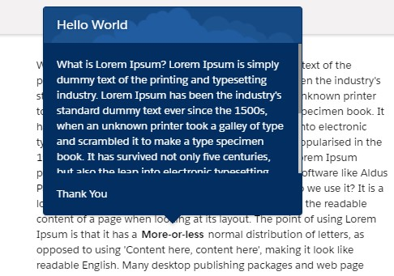
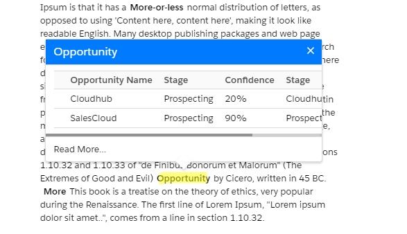

# Salesforce LWC Popovers

A robust, non-modal dialog component for Salesforce Lightning Web Components (LWC). This component is designed to be paired with a hoverable trigger element and supports various sizes, variants, and dynamic positioning.

## Project Structure

This project follows the **Salesforce DX (SFDX)** standard structure:

*   `force-app/main/default/lwc/popovers/`: Core component source code.
*   `docs/images/`: Visual assets for documentation.
*   `sfdx-project.json`: SFDX project configuration.
*   `jsconfig.json`: IntelliSense and VS Code configuration.

## Features

*   **Dynamic Positioning:** Automatically adjusts placement (Top, Bottom, Left, Right) based on viewport availability.
*   **SLDS Compliance:** Built using Salesforce Lightning Design System classes.
*   **Highly Customizable:** Supports slots for Header, Body, Footer, and the Trigger value.
*   **Responsive:** Handles screen overflows by adjusting coordinates and nubbin position.

## Component API

### Attributes

| Name | Type | Default | Description |
| :--- | :--- | :--- | :--- |
| `size` | `String` | `medium` | Dimensions of the popover: `small`, `medium`, `large`. |
| `variant` | `String` | `base` | Styling variant: `base`, `warning`, `error`, `brand`, `success`, `walk`, `walkalt`. |
| `placement` | `String` | `top` | Preferred alignment relative to the trigger: `top`, `bottom`, `left`, `right`. |
| `with-close` | `Boolean` | `false` | If true, shows a close button and stays open until manually closed. |

### Slots

| Name | Description |
| :--- | :--- |
| `value` | The trigger element. The user hovers over this to show the popover. |
| `header` | (Optional) The title text or HTML for the popover header. |
| `body` | The main content area of the popover. |
| `footer` | (Optional) Action area, typically for buttons or links. |

## Usage Example

```html
<c-popovers variant="brand" size="medium" placement="top">
    <!-- The element to hover over -->
    <div slot="value">
        <b>Hover over me!</b>
    </div>
    
    <!-- Popover Content -->
    <p slot="header">Popover Header</p>
    <div slot="body">
        This is the main body content of the popover.
    </div>
    <div slot="footer">
        Optional Footer Content
    </div>
</c-popovers>
```

### Visuals

**Standard Popover:**


**Rich HTML Content:**


## Developer Information

For detailed technical implementation details, see the [Technical Guide](force-app/main/default/lwc/popovers/README.md).

---
*Created and maintained as a high-performance LWC utility.*
